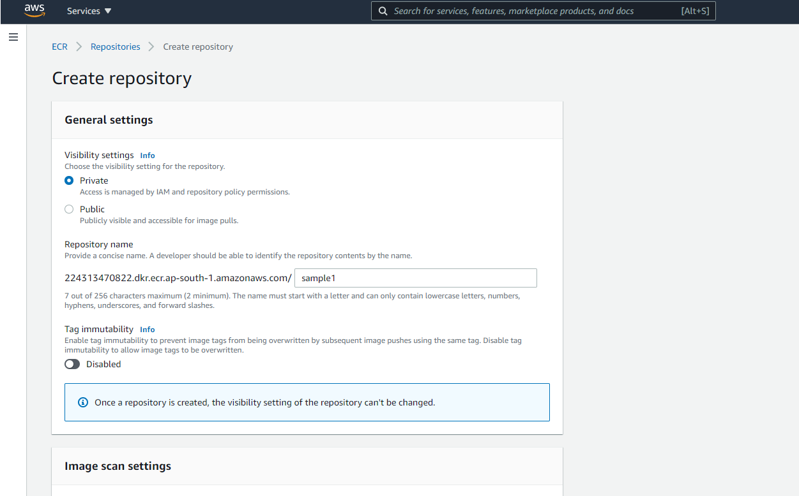
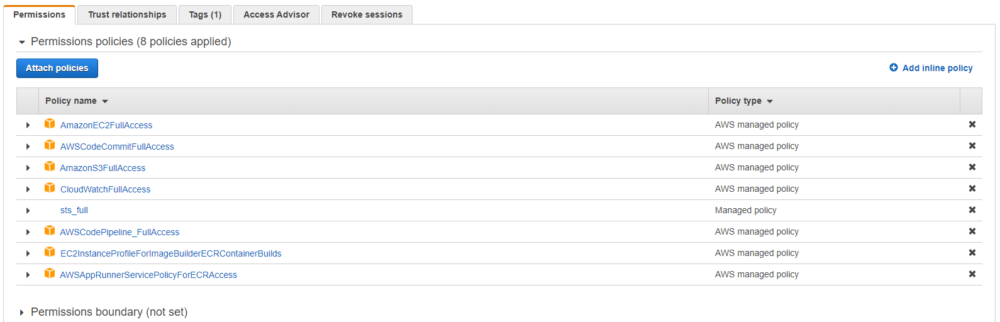
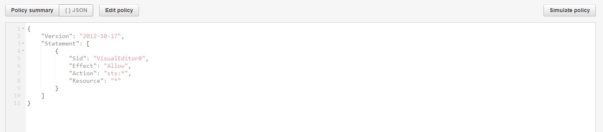
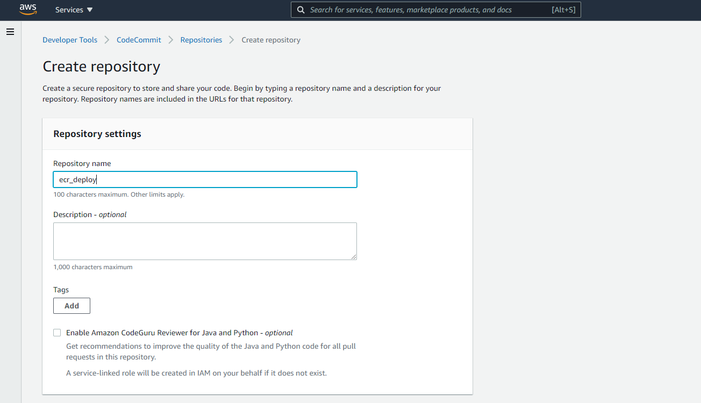
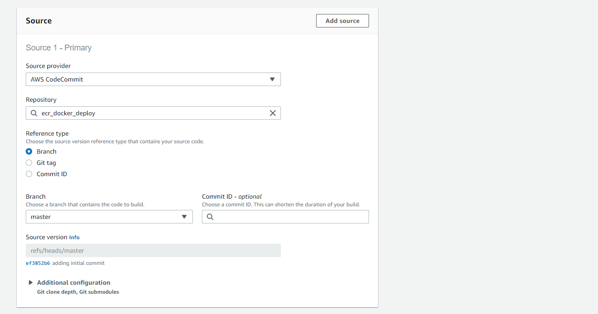
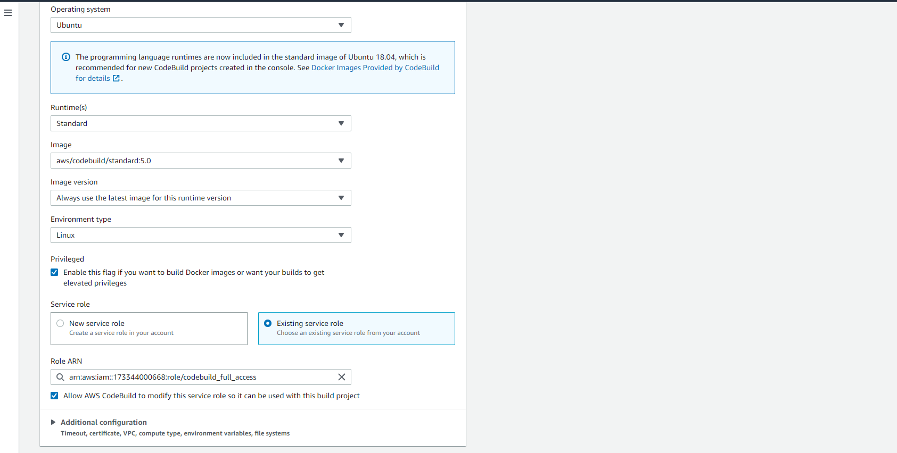
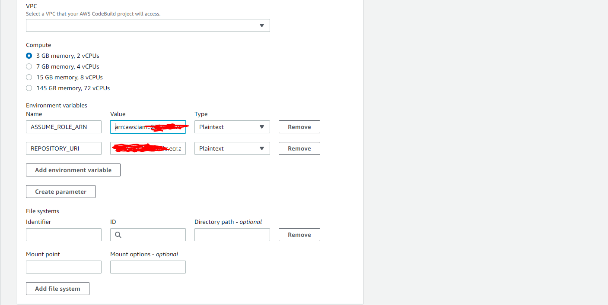
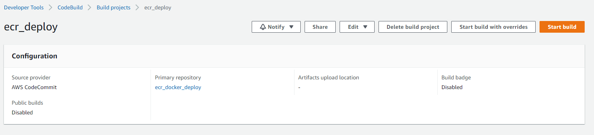

# Building a CI/CD pipeline for cross-account deployment of a Docker Image to ECR
Modern-day applications that reside on AWS have several distinct environments and accounts, such as dev, test, and staging. An application has to go through an elaborate process of deployment and testing in these environments before reaching its final destination. To achieve automated deployment of the application across different environments, you must use CI/CD pipelines.

Different DevOps models have been proposed that depict how a CI/CD pipeline deploys and promotes an application from one environment to another. In a typical model, pipelines are locally situated in each AWS account where deployment needs to happen. This post, however, focuses on a different model, in which CI/CD pipelines reside in a central AWS account called tools, and carry out deployments across other AWS accounts. This model has several advantages:

All pipelines are now located in a centralized account, which consolidates the security controls and grants increased visibility.
The AWS Identity and Access Management (IAM) permission model is greatly simplified because the pipelines can now share common IAM roles and policies. In addition, there is a clear demarcation between deployment-specific roles that pipelines assume and basic pipeline permissions.
Logs for all pipelines are located in a single account under Amazon CloudWatch.
For more information about CI/CD cross-account pipeline strategies, see Building a Secure Cross-Account Continuous Delivery Pipeline. In this post, we apply this strategy to deploying AWS Lambda-based APIs using the third-party Serverless Framework.
## Pre-requisits
Before proceeding any further, you need to identify and designate two AWS accounts required for the solution to work:

Tools – The AWS account where pipeline resides
Workload – The AWS account where deployment occurs

## Solution Overview
Start by building the necessary resources in the target account, as shown in the following architecture diagram. This consists of an IAM role that trusts the tools account and provides the required deployment-specific permissions. This IAM role is assumed by AWS CodeBuild in the tools account to carry out deployment. For simplicity, we refer to this role as the cross-account role, as specified in the architecture diagram.

You then build a CI/CD pipeline in the tools account using following below steps. After completing all the steps in this post, you will have a fully functioning CI/CD pipeline that deploys your Docker image  in the target account. The pipeline starts automatically every time you check in your changes into your CodeCommit repository.

## Steps to create Resources for Workload Account

* Create IAM Role with Policies that can be assumed by Tooling Account 
* Choose option to Another AWS account 
* Assign a policy's like below 
* Trust Relationship should lokk like below (Note:- please specify the codebuild role name you are going to assign to codebuild)

* create a ECR repository

## Steps to create Resources for Tools Account
* create IAM Role for Codebuild (Note:- show have permission to assume role , please dont forgot give sts full access)

* create Codecommit Repo and Push (buildspec.yaml and Dockerfile to repo)

* create codebuild like below 

* Start Build 

